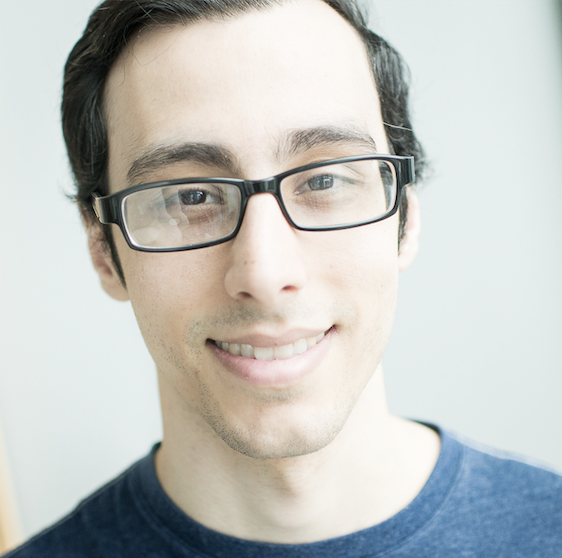

 

# Brief Bio
> I am a graduate student at the University of Chicago pursuing a PhD in  Biophysics. I did my undergraduate studies at the University of Illinois 
at Urbana-Champaign where I studied Physics. I am passionate about  
using my quantitative background to solve problems in genomics,  
ecology, and evolutionary biology. I am also interested in developing  workflows for scientific reproducibility.
