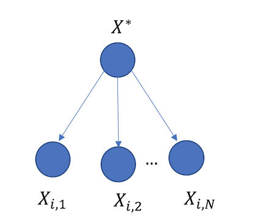

***
# __Protein Clusters__
***
## Modeling Protein Cluster Diversity in Pangenomic Data

Given a multi-sequence alignment, or a protein block, we wish to compute the diversity of the protein block. One motivation for doing this is to flag a group of homologues proteins that are undergoing a sweep. Suppose there are $N$ aligned sequences in the protein block, then the vector of residues at site $i$ is represented by $X_i$. We assume these $N$ sequences started from a common ancestor, and that they are equally far away from the ancestor in time. All the sequences have length $m$ (for now).

In order to quantify diversity, we first define a model. We use a first-order Markov model to calculate the likelihood of a vector $X_i$ having mutated from an ancestor $X^*$, and we margenalize over the ancestors using all 20 amino acids. The likelihood of a given vector of residues $X_i$, paramterized by the Markov chain $\theta$ is given by:

$$L(X_i|\theta) = \sum_{X^*} P(X^*) \prod_{j=1}^N P(X_{i,j}|X^*)$$
where $P(X^*)$ is the probability of that the ancestor is $X^*$, which is obtained from the stationary distribution of the Markov chain $\theta$. The conditionary distribution $P(X_{i,j}|X^*)$ is simply given by the Markov chain $\theta$.

Now we can perform likelihood ratio testing. In particular, we can define a score:

$$S = \log{\frac{L(X_i|\theta')}{L(X_i|\theta)}}$$
where $\theta'$ and $\theta$ are the alternative hypothesis and null hypothesis, respectively. For $\theta$, we can choose codon substitution matrices if we wish to test evolution or empirical matrices such as BloSum to test how conserved a region is. However, the alternative hypotehsis $\theta'$ will be quite sparse if calculated from the given protein blocks as there is not a lot of data. 

Instead, we take an alternative strategy where we alter the hypothesis $\theta$ in a way that increases the likelihood. This technique is typically referred to Phylogeny by Maximum Likelihood (PAML). 

We begin with a BloSum90 conditional distribution matrix, which henceforth I refer to as a transition matrix ($\theta$). Using this transition matrix, we compute the instantaneous rate matrix using the relationship $\theta(t) = \exp(Rt)$:

$$R = \frac{1}{t^*} \log{\theta} = \frac{1}{t^*} T^{-1} \log{(\Lambda}) T$$
where $T^{-1}\Lambda T$ is the eigendecomposition of $theta$. Next, we modify $R$ by multiplying it by a non-synonymous transition rate $\omega$. Using the modified instantaneous rate matrix, we re-compute $\theta$:

$$\theta(\omega) = \exp(R\omega) = D^{-1} \exp(M) D$$
where we have used eigendecomposition again to compiute the exponential of matrix $R\omega$. The value $t*$ represents the divergence time between the sequences used to compute BloSum90, however, we do not know what this value is, thus we set $t^* = 1$ and use $\omega$ in units of $t^*$. Now that we have $\theta(\omega)$, we can compute the likelihood and find the non-synonymous transition rate that maximizes the likelihood of a residue vector $X_i$, which we call $\hat{\omega}$:

$$\hat{\omega_i} = \underset{\omega}{\arg\max} \{ L(X_i|\theta(\omega))\}$$
Intuitively, if $\hat{\omega} > 1$ for a certain $X_i$, then $X_i$ is less likely to occur than predicted by BloSum. Similarly, $\hat{\omega} < 1$ indicates that $X_i$ is more likely to occur than predicted by BloSum. Values of $\hat{\omega} = 1$ are expected under BloSum.

$$ S_i = \log{\frac{L(X_i|\omega = \hat{\omega})}{L(X_i|\omega = 1)}} $$
and the total diversity would be:

$$ D = \sum_{i=1}^m S_i$$

### Short example

Suppose there are 3 protein sequences, and the $i$th position is polymorphic: 

$$X_i = \begin{pmatrix} A \\ A \\ W \end{pmatrix}$$

The likelihood that these 3 sequences came from a single ancestor $X^*$ is: ,

$$ L(X_i|\theta) = P(A) P(A|A)^2P(A|W) + P(R)P(A|R)^2P(A|W) + \ldots + P(V)P(A|V)^2P(W|V) $$
Some observations:

1) As $\omega$ increases, non-synonymous transitions such as $P(A|W)$ will increases, whereas terms such as $P(A|A)$ decrease due to the normalization constraint, i.e.  $\sum_{i=1}^{20} P(A|X_i) = 1$. Thus, $\omega$ cannot grow arbitrarily large.

2) Synonymous transitions will always have $\hat{\omega} = 1$, and thus $S_i = 0$.

  